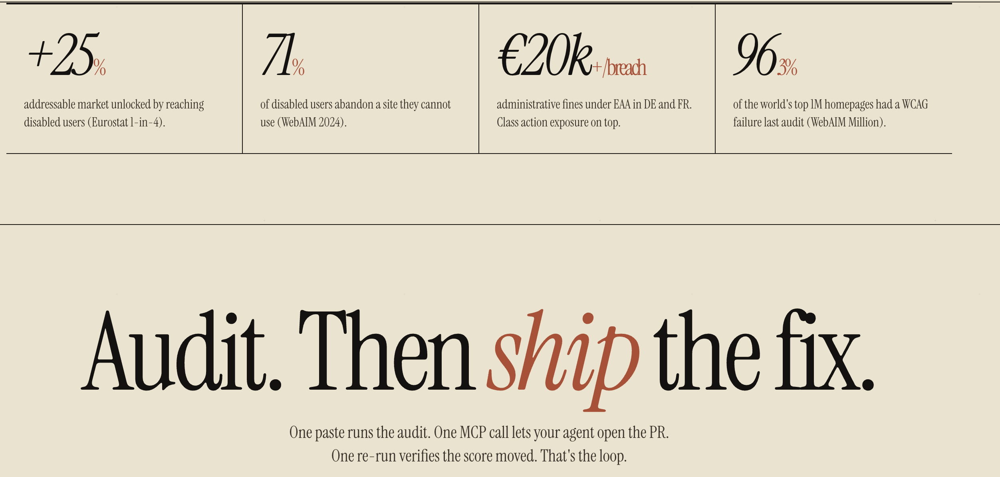

<div align="center">

# Loop11y

Accessibility, in a loop — **audit · insight · fix · verify**. Hand the report to your AI agent and ship the PR. CLI, MCP server, GitHub Action, HTTP API.

[](https://www.npmjs.com/package/loop11y)
[](https://github.com/tayyabataimur/loop11y/actions/workflows/ci.yml)
[](./LICENSE)
[](https://nodejs.org)

[**loop11y.tayyaba.dev**](https://loop11y.tayyaba.dev) — paste a URL, get an audit. No signup.

</div>

---

```bash
npx -y loop11y audit https://your-site.com --html --output report.html
```

<a href="https://loop11y.tayyaba.dev">
  
</a>

One paste runs the audit. One MCP call lets your agent open the PR. One re-run verifies the score moved. That's the loop. Each issue is patch-ready for your AI agent — Claude Code / Cursor / Cline / Copilot / Aider / Codex all speak Loop11y via MCP. Same engine powers [the web demo](https://loop11y.tayyaba.dev), the MCP server, and the GitHub Action.

Sample reports: [audit](https://htmlpreview.github.io/?https://github.com/tayyabataimur/loop11y/blob/main/examples/sample-report.html) · [before/after diff](https://htmlpreview.github.io/?https://github.com/tayyabataimur/loop11y/blob/main/examples/sample-diff-report.html).

## Install

| Surface | Command |
|---|---|
| CLI | `npm i -g loop11y` or `npx -y loop11y` |
| Agent Skill (Claude Code, Cursor, Cline, Codex, [50+ others](https://skills.sh)) | `npx skills add tayyabataimur/loop11y-skill -g -a claude-code` |
| MCP server (stdio) | add to client config (see below) |
| MCP server (HTTP) | `LOOP11Y_PORT=3000 npx -y loop11y` |
| GitHub Action | `uses: tayyabataimur/loop11y/action@v0.1.0` |
| Harness SDK | `import { Loop11yClient } from "loop11y/harness-sdk"` |
| Docker | `docker build -t loop11y . && docker run -p 3000:3000 -e LOOP11Y_PORT=3000 loop11y` |

## CLI

```bash
loop11y audit <url>                    [--json|--markdown|--sarif|--html] [--output <file>]
loop11y audit:file <path>              [--json|--markdown|--sarif|--html] [--output <file>]
loop11y audit:repo <path>              [--max-files <n>] [--base-url <url>]
loop11y crawl --url <url>              [--max-pages <n>] [--include-pattern <re>] [--exclude-pattern <re>]
loop11y crawl --sitemap <url>          [--max-pages <n>]
loop11y crawl --routes <file>          [--max-pages <n>]
loop11y verify <source-path> --url <url>
loop11y diff <before.json> <after.json> --output report.html
```

Threshold gates: `--fail-on critical|serious|moderate|minor`, `--max-violations <n>`, `--baseline <report.json>`.

Auth for protected pages:

```bash
loop11y audit http://localhost:3000/dashboard \
  --storage-state ./playwright/.auth/user.json \
  --header 'x-env: staging'
```

Crawl auto-detects `/sitemap.xml`, `/sitemap_index.xml`, and `robots.txt` `Sitemap:` directives. Tracking params (`utm_*`, `gclid`, `fbclid`, …) are stripped before dedupe. Discovery is post-hydration via Playwright, so SPA routes (Next.js, Remix, etc.) are found.

## MCP

stdio (Claude Desktop / Claude Code / Cursor / Cline):

```json
{
  "mcpServers": {
    "loop11y": { "command": "npx", "args": ["-y", "loop11y"] }
  }
}
```

Streamable HTTP transport: `POST /mcp` once `LOOP11Y_PORT=3000 npx -y loop11y` is running.

Tools exposed: `evaluate`, `audit_component`, `audit_repo`, `crawl_site`, `remediate`, `fix_component`. (`verify` is CLI / HTTP only.)

## HTTP API

```bash
LOOP11Y_PORT=3000 npx -y loop11y
```

| Endpoint | Purpose |
|---|---|
| `POST /api/evaluate` | audit a single URL |
| `POST /api/crawl` | crawl + audit a site |
| `POST /api/repo-audit` | scan a checked-out repo |
| `POST /api/remediate` | report / diff / fix a source file |
| `POST /api/verify` | re-audit after a remediation |
| `POST /mcp` | streamable HTTP MCP transport |
| `GET /openapi.json` | OpenAPI 3 spec (ChatGPT GPT Action, n8n, Zapier) |
| `GET /.well-known/ai-plugin.json` | plugin manifest |
| `GET /health` | liveness |

## GitHub Action

```yaml
- uses: tayyabataimur/loop11y/action@v0.1.0
  with:
    url: https://staging.example.com
    fail-under: 90
```

Posts a Markdown report as a PR comment, sets check status. See [`action/README.md`](./action/README.md).

## Output formats

| Flag | Use |
|---|---|
| `--json` (default) | machine-readable, baseline diff input |
| `--markdown` | PR comments, Slack |
| `--html` | self-contained visual report, shareable |
| `--sarif` | GitHub Code Scanning, Sonar |

Determinism: viewport pinned to 1280×800, `reducedMotion: reduce`, axe-core version emitted on every report.

## Local development

```sh
git clone https://github.com/tayyabataimur/loop11y.git
cd loop11y
npm install
npx playwright install chromium
npm run build
node dist/index.js              # stdio MCP
LOOP11Y_PORT=3000 node dist/index.js   # HTTP + MCP-over-HTTP
node dist/index.js audit https://example.com --html --output /tmp/r.html
```

Sample report regen: `npm run sample:screenshots`.

## Stack

axe-core 4.10 · Playwright (Chromium) · TypeScript · Zod · MCP TypeScript SDK · ts-morph (source-aware fixes).

Vercel cannot run Playwright + Chromium under serverless function limits, so the audit engine is intended for Fly / Docker / local. Vercel hosts the web frontend (`web/`); it proxies `/api/audit` to the Fly backend via `A11Y_API_URL`.

## Docs

- [`docs/ARCHITECTURE.md`](./docs/ARCHITECTURE.md) — request flow, source mapping
- [`docs/THREAT-MODEL.md`](./docs/THREAT-MODEL.md) — what loop11y does and does not protect against
- [`docs/INTEGRATIONS.md`](./docs/INTEGRATIONS.md) — agent / IDE / CI matrix
- [`CHANGELOG.md`](./CHANGELOG.md)
- [`SECURITY.md`](./SECURITY.md)

## Author

[Tayyaba Taimur](https://tayyaba.dev) · MIT licensed.
